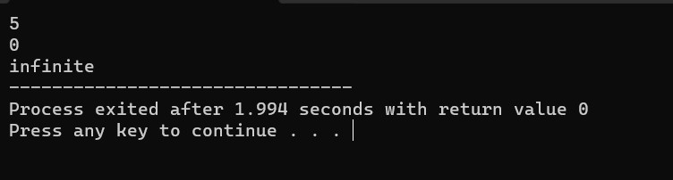
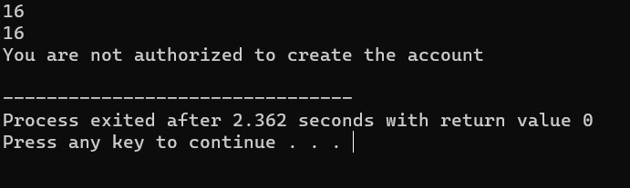

# Exception-Handling

1][five by zero](fivebyzero.cpp)
This C++ program allows the user to input a numerator and a denominator, performs division, and handles the case of division by zero using exception handling. If the denominator is zero, it throws an exception with the message "infinite," which is caught and displayed by the catch block. This code serves as an example of using exceptions to handle exceptional cases in C++.

  

 

2] [Age checker](socialmediaage.cpp)
This C++ program checks whether a user is authorized to create an account based on their age. If the age is less than 18, it throws an exception with a message indicating that the user is not authorized. Otherwise, it displays a message confirming authorization. This code demonstrates a basic example of exception handling in C++.

  

 
